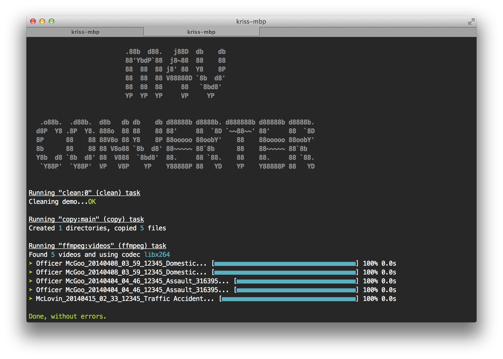

grunt-movie-converter
=====================

Grunt script that will convert video to m4v

## Execution
When you're inside the folder with `Gruntfile.coffee` then you can execute like this:

    grunt --src=~/Movies --dest~/Movies/Converted

**WARNING**  This is a destructive script. It will delete the old movie once it converts successfully

## License
This script is licensed under [MIT](License.md). Do what you want with it.
